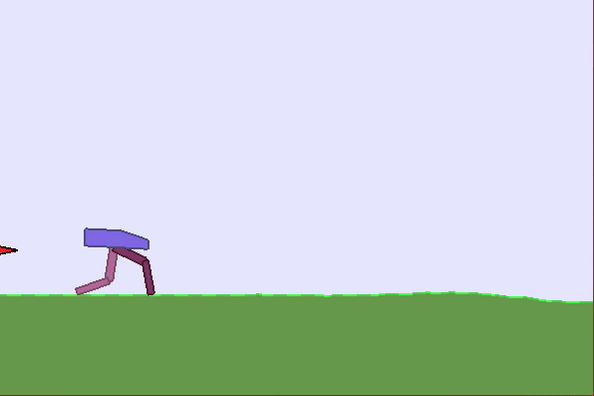

## Key packages verison
* numpy==1.16
* tensorflow==1.14
* gym==0.15.4
* ray==1.2

## What can this repository do

* Reinforcement learning algorithm PPO, with parallel sampling, continous/discrete action space 
* Inverse reinforcement learning algorithm AIRL, with parallel sampling, continous/discrete action space
* Expert trajectory generator
* parallel sampling feature can greatly speed up the overall training process especially with HPC

## Run the codes

* PPO: ```python run_ppo_combo_gym.py```
* Generate expert trajectory: ```python sample_expert_data.py```
* AIRL: ```python run_AIRL_combo_gym.py```


## Tune the hyperparameter

* The hyperparameters can be changed in ```argparser()``` or command line, e.g., ```python run_ppo_combo_gym.py --clip_value 0.1```
* The hyperparameters ```args.num_parallel_sampler``` setups the number of parallel sampler will be used
* The hyperparameters ```args.sample_size``` setups the total number of samples per iteration

## Some results

* The PPO and AIRL have been tested with openai-gym environments, e.g., ```CartPole-v1```, ```Pendulum-v0```, and ```BipedalWalker-v2```
* Some training results and models are saved in the directories
* The training result with ```BipedalWalker-v2``` is shown here as an example.

**PPO:**      
**AIRL:**      

<br> 
